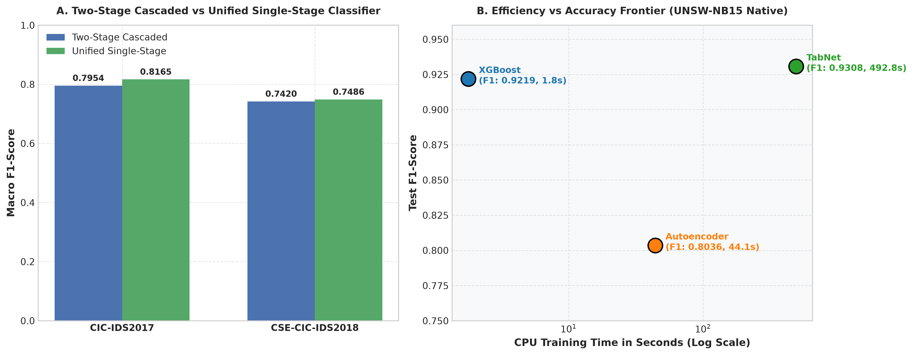
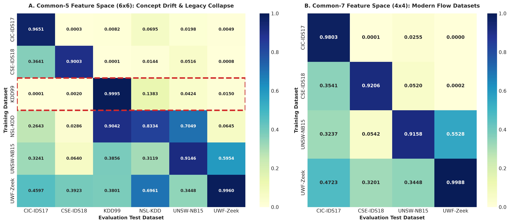
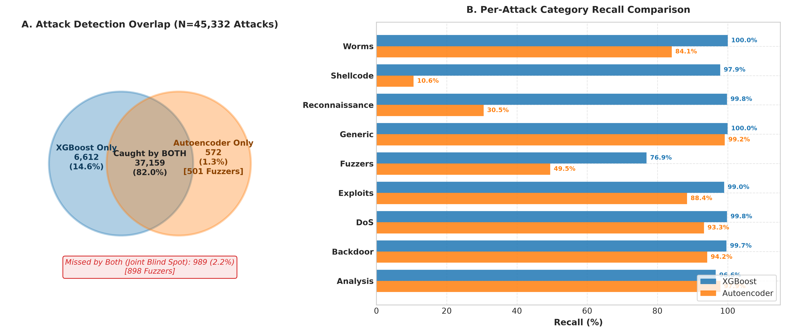

# Network Intrusion Detection System (NIDS) Research Benchmark

An empirical benchmark evaluating **Two-Stage Cascaded Classification**, **Unified Single-Stage Classification**, and **Unsupervised Anomaly Detection** across 6 network intrusion datasets (~16.69 Million total traffic flows).

---

## 1. Project Overview

Modern enterprise and Financial Services (BFSI) networks process billions of packets daily, making automated Intrusion Detection Systems (IDS) vital for mitigating operational risk, compliance violations, and zero-day threats. A critical architectural dilemma in machine-learning-based NIDS design is whether to deploy a two-stage cascaded pipeline (binary attack/benign filtering followed by multi-class attack categorization) or a single unified multi-class model. Furthermore, supervised models struggle to detect novel payload mutations without baseline retraining. This research project addresses two core questions: (1) Does a two-stage cascaded detection architecture outperform a single unified multi-class classifier across standardized feature spaces? and (2) Can unsupervised anomaly detection provide complementary detection coverage for attack types where supervised models fail?

---

## 2. Datasets

The benchmark evaluates six network intrusion datasets spanning legacy packet captures, modern flow statistics, enterprise subnets, and Zeek connection logs:

| Dataset | Total Flows | Train Rows | Test Rows | Native Features | Type / Context |
| :--- | :---: | :---: | :---: | :---: | :--- |
| **KDD99** | 4,898,431 | 3,918,744 | 979,687 | 58 | Legacy connection-based synthetic benchmark (1999) |
| **NSL-KDD** | 148,517 | 125,973 | 22,544 | 58 | Refined subset of KDD99 eliminating redundant records |
| **UNSW-NB15** | 257,673 | 175,341 | 82,332 | 61 | Hybrid synthetic & real modern network traffic (IXIA PerfectStorm) |
| **CIC-IDS2017** | 2,830,743 | 2,264,591 | 566,152 | 92 | Modern PCAP flow statistics generated by CICFlowMeter |
| **CSE-CIC-IDS2018** | 6,659,532 | 5,327,621 | 1,331,911 | 79 | AWS cloud enterprise infrastructure network traffic |
| **UWF-ZeekData24** | 1,898,613 | 1,518,890 | 379,723 | 19 | Real-world operational network traffic processed via Zeek logs |
| **TOTAL** | **16,693,509** | **13,331,160** | **3,362,349** | — | **6 Datasets Combined** |

---

## 3. Architecture

### Feature Spaces (Cross-Dataset Comparability)

To evaluate cross-dataset transferability and model generalization, three distinct feature spaces are defined:
1. **Native Feature Space**: Full feature set provided by the original dataset (19 to 92 features).
2. **Common-5 Feature Space**: The minimal overlapping flow feature set present across all 6 datasets (`duration`, `src_bytes`, `dst_bytes`, `protocol`, `service`).
3. **Common-7 Feature Space**: Extended overlapping feature set present across flow-based datasets (`duration`, `src_bytes`, `dst_bytes`, `src_packets`, `dst_packets`, `protocol`, `service`).

### Modeling Pipelines

```
[ Incoming Network Traffic Flow ]
              │
              ├───► [ Single-Stage Unified Classifier ] ─────────────► Multi-class Output
              │
              ├───► [ Stage 1 Binary Classifier (XGBoost) ]
              │             │
              │             ├──► BENIGN  (Filtered)
              │             └──► ATTACK  ──► [ Stage 2 Multi-class Classifier ] ──► Attack Category
              │
              └───► [ Unsupervised Autoencoder Anomaly Detector ] ──► MSE Reconstruction Error
```

1. **Stage 1 (Binary Attack Filter)**: High-speed binary classifier trained with loss-gradient class weighting (`scale_pos_weight`) to handle class imbalance.
2. **Stage 2 (Multi-Class Classifier)**: Categorizes flagged attack traffic into specific threat types (DoS, DDoS, Exploits, Fuzzers, Brute Force, Probe, etc.).
3. **Unified Single-Stage Classifier**: Direct multi-class classifier predicting BENIGN or specific attack categories in a single pass.
4. **Autoencoder Anomaly Detector**: Unsupervised bottleneck neural network trained exclusively on benign traffic to flag out-of-distribution flows.

---

## 4. Key Results

### Stage 1 Binary Classifier Accuracy Across Datasets & Feature Spaces

| Dataset | Native Features | Common-7 Features | Common-5 Features |
| :--- | :---: | :---: | :---: |
| **KDD99** | **99.99%** | — | 99.92% |
| **NSL-KDD** | 79.02% | — | **83.27%** |
| **UNSW-NB15** | **90.99%** | 90.55% | 90.41% |
| **CIC-IDS2017** | **99.89%** | 99.21% | 98.59% |
| **CSE-CIC-IDS2018** | **97.96%** | 96.85% | 95.98% |
| **UWF-ZeekData24** | **99.88%** | 99.88% | 99.61% |

### Two-Stage Cascaded vs. Unified Single-Stage Classification

Evaluated on Common-5 feature space across full multi-class test sets:

| Dataset | Model Architecture | Macro Precision | Macro Recall | Macro F1-Score | Weighted F1-Score | Overall Accuracy |
| :--- | :--- | :---: | :---: | :---: | :---: | :---: |
| **CIC-IDS2017** | Two-Stage Cascaded | 0.8798 | **0.7868** | 0.7954 | 0.9857 | 98.58% |
| **CIC-IDS2017** | Unified Single-Stage | **0.9787** | 0.7737 | **0.8165** | **0.9884** | **98.88%** |
| **CSE-CIC-IDS2018** | Two-Stage Cascaded | 0.8167 | 0.7294 | 0.7420 | 0.9438 | 95.09% |
| **CSE-CIC-IDS2018** | Unified Single-Stage | **0.8750** | **0.7305** | **0.7486** | **0.9503** | **95.86%** |



*Finding*: Unified single-stage models achieve slightly higher Macro F1-Scores (+2.11% on CIC-IDS2017, +0.66% on CSE-CIC-IDS2018) because two-stage cascaded models propagate Stage 1 false-negative errors into Stage 2.

### Common-5 vs. Common-7 Feature Space Comparison

Models were extended to the Common-7 feature space (19 features, adding `tot_fwd_pkts` / `tot_bwd_pkts`) for the 4 datasets that support it. All values are Macro F1-Score from `results/model_benchmarks.json`:

| Dataset | Stage 2 Cascaded C5 | Stage 2 Cascaded C7 | Δ Stage 2 | Unified C5 | Unified C7 | Δ Unified |
| :--- | :---: | :---: | :---: | :---: | :---: | :---: |
| **CIC-IDS2017** | 0.7954 | 0.7166 | −0.0788 | 0.8165 | **0.8440** | +0.0275 |
| **CSE-CIC-IDS2018** | 0.7420 | 0.7217 | −0.0203 | 0.7486 | **0.7770** | +0.0284 |
| **UNSW-NB15** | 0.5476 | 0.5473 | −0.0003 | 0.5336 | **0.5392** | +0.0056 |
| **UWF ZeekData** | 0.8492 | **0.8902** | +0.0410 | 0.8505 | **0.8848** | +0.0343 |

*Finding*: Common-7 consistently improves Unified single-stage models across all datasets (+0.006 to +0.028 Macro F1). For Stage 2 cascaded pipelines, Common-7 helps UWF ZeekData (+0.041) but drops CIC-IDS2017 by −0.079.

**Verified root cause of the CIC-IDS2017 cascade drop** (investigated post-training via live per-class confusion matrices): Stage 1 Common-7 misses 31,550 of 31,786 Probe/Reconnaissance flows (0.0074 recall), which accounts for 90.86% of all Stage 1 attack false negatives (34,725 total FNs across all attack classes). Because Stage 1 routes 99.26% of Probe/Recon flows directly to BENIGN, Stage 2 in cascaded mode never receives them, dropping cascaded Probe/Recon recall to 0.0070 and dragging cascaded Macro F1 down to 0.7166. In contrast, the Unified C7 single-stage model evaluates all flows directly without two-stage routing, achieving 0.8440 Macro F1.

### Concept Drift & Cross-Dataset Generalization Collapse



Evaluating models trained on legacy synthetic datasets against modern network traffic reveals catastrophic performance degradation due to temporal concept drift:

* **KDD99 Model \(\to\) CIC-IDS2017 Test Set**: F1-Score = **0.0001** (Accuracy = 79.57%, classifying almost all modern traffic as Benign).
* **KDD99 Model \(\to\) UNSW-NB15 Test Set**: F1-Score = **0.0255** (Accuracy = 44.83%).
* **KDD99 Model \(\to\) UWF-ZeekData24 Test Set**: F1-Score = **0.0000** (Accuracy = 50.46%).

*Conclusion*: Models trained on 1990s connection-based metrics fail completely on modern flow-based networks, demonstrating that benchmark longevity requires continuous retraining on active traffic distributions.

### Complementary Anomaly Detection: Autoencoder vs. XGBoost



Evaluated on UNSW-NB15 Native Test Set ($N=82,332$ flows):

#### Per-Attack Category Recall Breakdown

| Attack Category | Test Count ($N$) | XGBoost Recall | Autoencoder Recall | Recall Delta | AE Only Caught | XGB Only Caught | Both Caught | Missed by Both |
| :--- | :---: | :---: | :---: | :---: | :---: | :---: | :---: | :---: |
| **Analysis** | 677 | 96.60% | **97.93%** | **+1.33%** | **17** | 8 | 646 | 6 |
| **Backdoor** | 583 | **99.66%** | 94.17% | -5.49% | 0 | 32 | 549 | 2 |
| **DoS** | 4,089 | **99.80%** | 93.25% | -6.55% | 7 | 275 | 3,806 | 1 |
| **Exploits** | 11,132 | **99.00%** | 88.44% | -10.56% | 39 | 1,215 | 9,806 | 72 |
| **Fuzzers** | 6,062 | **76.92%** | 49.49% | -27.43% | **501** | 2,164 | 2,499 | 898 |
| **Generic** | 18,871 | **99.98%** | 99.18% | -0.80% | 1 | 152 | 18,716 | 2 |
| **Reconnaissance** | 3,496 | **99.80%** | 30.52% | -69.28% | 3 | 2,425 | 1,064 | 4 |
| **Shellcode** | 378 | **97.88%** | 10.58% | -87.30% | 4 | 334 | 36 | 4 |
| **Worms** | 44 | **100.00%** | 84.09% | -15.91% | 0 | 7 | 37 | 0 |
| *Normal (Benign)* | 37,000 | **84.17%** | 70.69% | -13.48% | - | - | - | - |

#### Overall Attack Detection Venn Breakdown ($N=45,332$ Attack Flows)

```
+-----------------------------------------------------------------------+
| TOTAL TEST ATTACKS: 45,332                                             |
|                                                                       |
|  [ Caught by BOTH XGBoost & Autoencoder ]                             |
|  37,159 flows (81.97%)                                                |
|                                                                       |
|  [ Caught by XGBoost ONLY ]           [ Caught by Autoencoder ONLY ]  |
|  6,612 flows (14.59%)                 572 flows (1.26%)               |
|                                       -> 501 are Fuzzers (87.6%)      |
|                                                                       |
|  [ MISSED BY BOTH - Joint Blind Spot ]                                |
|  989 flows (2.18%) -> 898 are Fuzzers (90.8%)                         |
+-----------------------------------------------------------------------+
```

*Standout Empirical Insight*: While supervised XGBoost achieves a higher overall F1-score (`0.9219` vs `0.8036`), the Autoencoder detected **572 attack flows that bypassed XGBoost entirely**. **87.6% of those unique detections (501 flows) were Fuzzers attacks** — XGBoost's weakest category. Conversely, the Autoencoder suffers severe blind spots on stealthy probing attacks (*Reconnaissance* and *Shellcode*) whose feature distributions closely mimic normal traffic.

---

## 5. Setup & Reproduction

### Prerequisites & Environment Setup

```bash
# Clone repository
git clone https://github.com/GunjanPahwa/IDS-Research.git
cd IDS-Research

# Create Conda environment
conda create -n ids_research python=3.10 -y
conda activate ids_research

# Install dependencies
pip install -r requirements.txt
```

### Execution Pipeline

```bash
# 1. Run Data Preprocessing & Feature Alignment
python src/preprocessing/pipeline.py

# 2. Train Stage 1, Stage 2, and Unified Models
python src/train_and_evaluate.py

# 3. Artifact Locations
# Saved Models:   models/*.pkl (38 model files)
# Benchmarks:     results/model_benchmarks.json
# Research Doc:   docs/complementary_detection_findings.md
```

---

## 6. Tech Stack

* **Core Language**: Python 3.10
* **Gradient Boosting**: `xgboost` (v3.1.1)
* **Deep Learning Framework**: `torch` (v2.6.0+cpu), `pytorch-tabnet`
* **Machine Learning Tools**: `scikit-learn` (v1.6.1)
* **Data Manipulation**: `pandas` (v2.2.3), `numpy` (v2.1.2)
* **Serialization & Utilities**: `pickle`, `json`, `pathlib`

---

## 7. Future Work

The following items represent planned architectural extensions:
1. **Hybrid Meta-Ensemble**: Integrating the Autoencoder reconstruction error as a continuous input feature into XGBoost to eliminate *Fuzzers* blind spots without increasing false positives.
2. **Selective TabNet GPU Acceleration**: Expanding TabNet evaluation across high-volume datasets (CIC-IDS2017, CSE-CIC-IDS2018) under GPU-accelerated environments.
3. **Automated Hyperparameter Optimization**: Running Optuna Bayesian hyperparameter sweeps for `scale_pos_weight` and tree depth on non-UNSW datasets.
